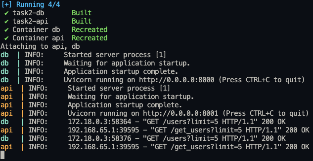
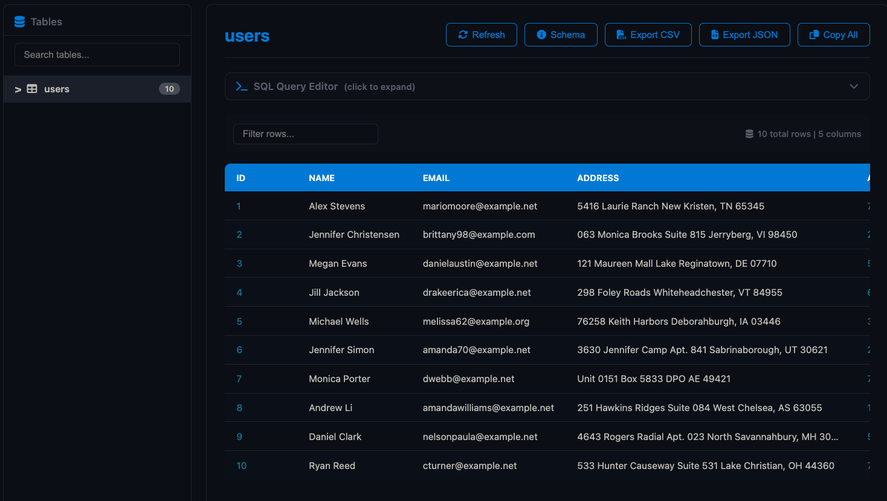
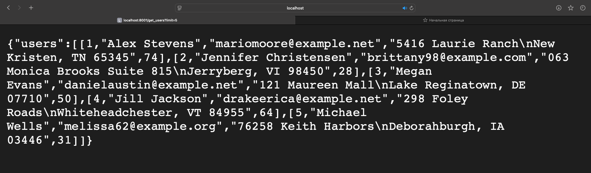
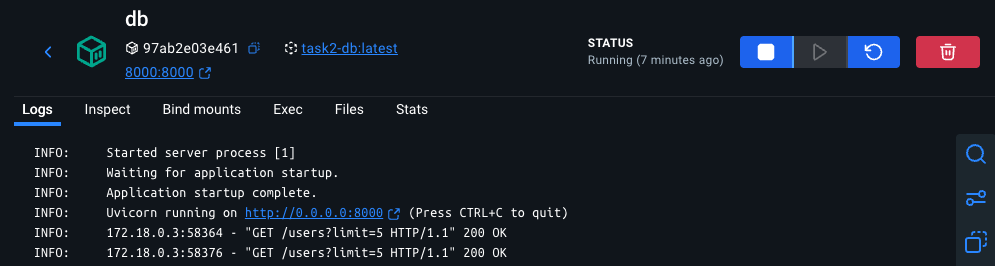
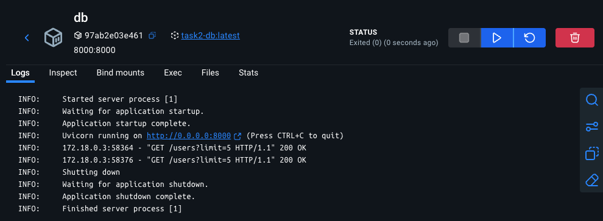
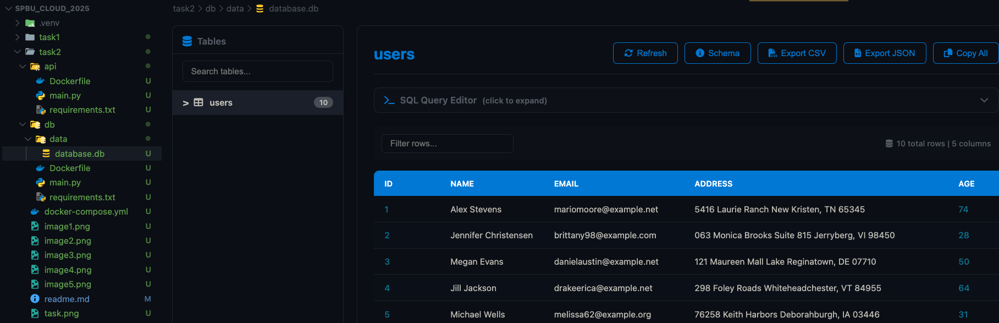
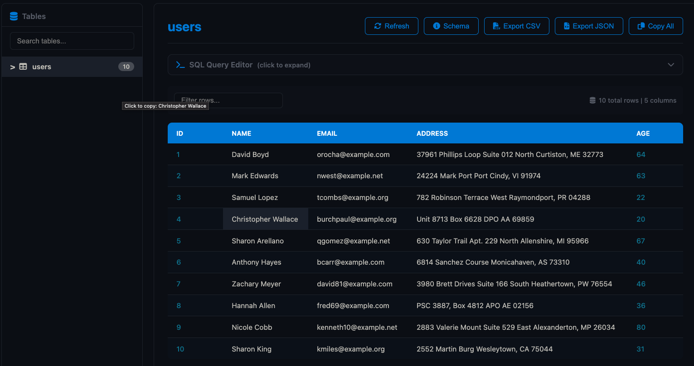
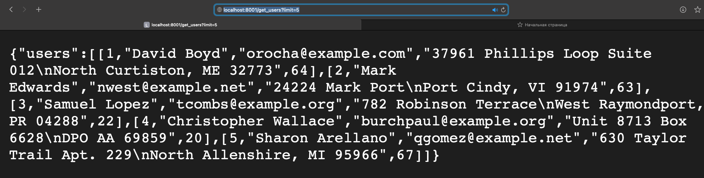

#### Docker command:
docker-compose up --build
#### Http request:
http://localhost:8001/get_users?limit=5
#### Docker Hub link:
https://hub.docker.com/u/yukithekilla

#### Docker build result:

#### Database example:

#### Request result:

#### Database is saved after container shutdown:

#### If database is deleted new data is generated:

