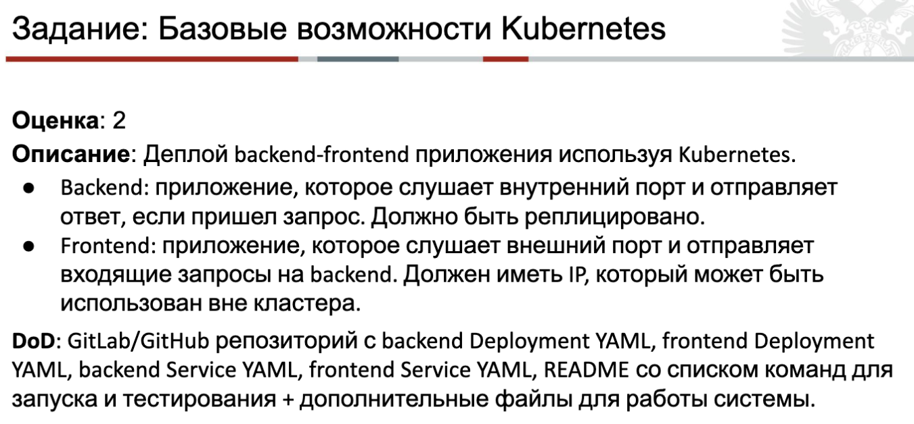

#### Result:


#### Frontend/Backend startup:
```zsh
cd task3/{backend,frontend}
minikube startup
eval $(minikube docker-env)
docker build -t music-player-{backend,frontend}:latest .
kubectl apply -f k8s.yaml
```

##### All console_output is saved to task3/{backend,frontend}/console_output.html

#### To get pods: 
```zsh
kubectl get pods
```
#### To get service status:
```zsh
kubectl get services
```
#### To get frontend url:
```zsh
minikube service music-player-frontend-service --url 
```
#### To get backend url:
```zsh
kubectl port-forward service/music-player-backend-service 8020:8000
```
URL for browser:
- http://localhost:8020

#### Backend requests:
##### Check health
- http://localhost:8020/health

##### Get all tracks
- http://localhost:8020/tracks

##### Get current track
- http://localhost:8000/current

##### Get next track
- http://localhost:8020/next

##### Get previous track
- http://localhost:8020/previous

##### Shuffle track queue
- -X POST http://localhost:8020/shuffle
##### Sequential track queue
- -X POST http://localhost:8020/sequential
##### Stream track with id (1 to 5)
- http://localhost:8020/stream/1
