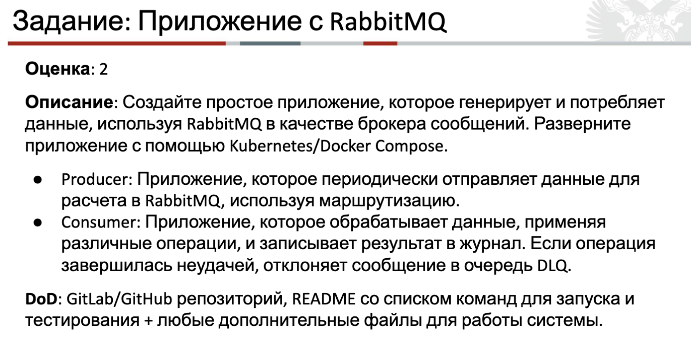
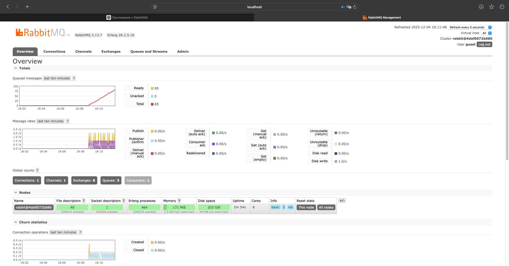
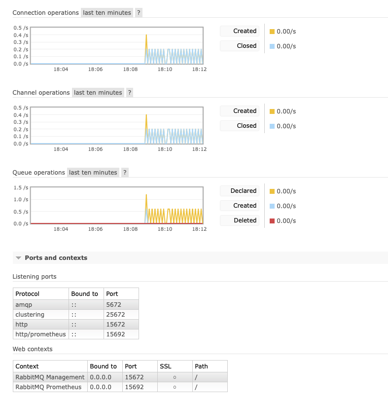
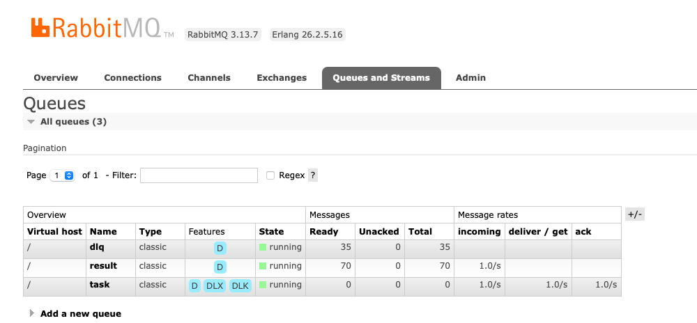

##### Producer - send data: pd.DataFrame with x, y columns
##### Consumer - use data to get MAE, MSE, R2 errors from LinearRegression predictions.
##### Every 10 seconds the producer sends a request, every third request contains incorrect data, which is why the request ends up in the DLQ

#### Docker startup:
```zsh
docker-compose up --build
```
#### Rabbitmq username/password:
```zsh
guest / guest
```
#### Docker container list:
```zsh
docker container list 
```

#### Results:


